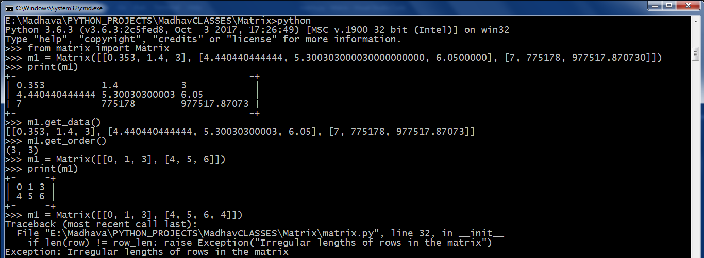

# Matrix

The Matrix in Mathematics is implemented as a Data Structure.

This module contains a class called "Matrix" which contains about 30 methods for the manipulation of the matrix. Except some advanced concepts like EigenValues, EigenVectors and Diagonalisation, everything is covered.

